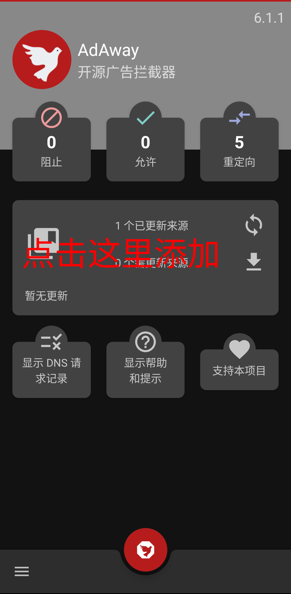
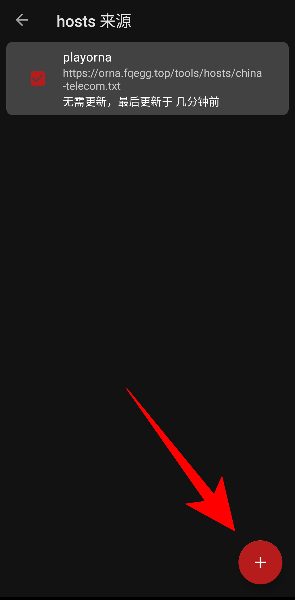
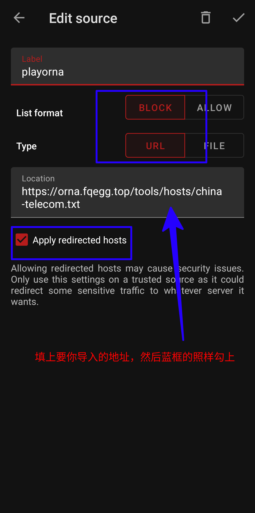

# 缓解 Orna 在国内长翻书的问题

只能优化连接的延时（特别是用**中国移动**的玩家），而关于游戏数据库操作的延时不会降低，特别是背包相关的，因为这是游戏的问题，所以这种情况应是**清理背包**。

1. 第一种方法：使用**加速器**，这里不展开说了。
2. 第二种方法：使用 cloudflare 的优选 ip ，查看[原理](#原理)。（**不是加速器**，**不是加速器**，**不是加速器**）

第二种方法的做法如下。

## 安装 AdAway

本质是去广告 app ，只是利用它的功能，不需要去广告功能可以删除掉里面的规则。

[点击下载](https://mirrors.tuna.tsinghua.edu.cn/fdroid/repo/org.adaway_60101.apk)，或者复制下面链接到浏览器下载。

```
https://mirrors.tuna.tsinghua.edu.cn/fdroid/repo/org.adaway_60101.apk
```

安装后，选择 vpn 模式。

## 导入文件

根据你的运营商，选择下面其中一个文件导入

**我不保证一定能用，但至少我已经测试过，如果遇到什么问题记得向我反馈，我才能适当调整**

### 中国电信

```
https://orna.fqegg.top/tools/hosts/china-telecom.txt
```

备用

```
https://orna.fqegg.top/tools/hosts/china-telecom-1.txt
```

### 中国移动

```
https://orna.fqegg.top/tools/hosts/china-mobile.txt
```

备用

```
https://orna.fqegg.top/tools/hosts/china-mobile-1.txt
```

### 中国联通

```
https://orna.fqegg.top/tools/hosts/china-unicom.txt
```

备用

```
https://orna.fqegg.top/tools/hosts/china-unicom-1.txt
```

### TW

```
https://orna.fqegg.top/tools/hosts/tw.txt
```

备用

```
https://orna.fqegg.top/tools/hosts/tw-1.txt
```

## 启动 AdAway

启动前，开关下飞行模式

## 图片教程

1. 点击添加


2. 按照图片描述填写，然后右上角保存


## 原理

Orna 和 HoA 都是托管在 Cloudflare 的网络上，由于 Cloudflare CDN 的特点，它会提供大量的任播 ip ，每个 ip 只要你使用对应的 SNI ，都能连接到同一个网站（不懂的可以搜索下，cloudflare 优选 ip ）。但你运营商不可能每次都给你分配延时最低和最快的，所以我们就需要优选一个 ip ，然后通过 adaway 来将游戏域名解析到这些 ip 上。

## 感谢

-  [优选网站](https://stock.hostmonit.com/CloudFlareYes)